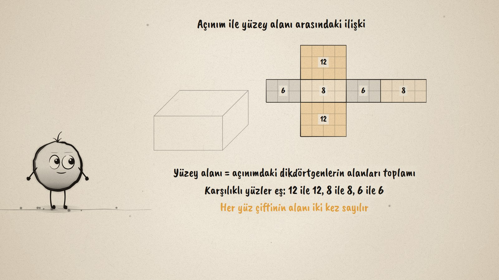
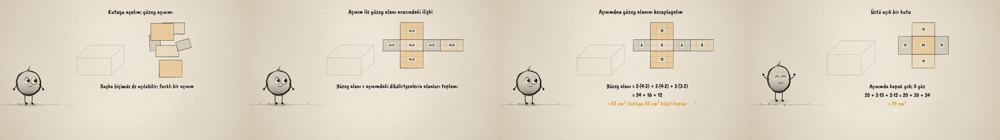

# Kutuyu Aç · Surface Area of a Rectangular Prism

**▶ Tarayıcıda izleyin / Watch in the browser:** https://hakanatas.github.io/kutuyu-ac/ 
**⬇ MP4 + altyazılar / MP4 + subtitles:** [Releases](https://github.com/hakanatas/kutuyu-ac/releases) 
**✎ Kullanılan istem / The prompt behind it:** [PROMPT.md](PROMPT.md) 
**🎞 Bütün filmler / All films:** [Nokta'nın Filmleri](https://hakanatas.github.io/nokta-filmleri/?sinif=7)

> **TR —** 7. sınıf matematik "Geometrik Nicelikler" temasındaki MAT.7.4.2 öğrenme çıktısı için hazırlanmış, tamamen JavaScript ile çizilen 92 saniyelik mürekkep animasyonu. Ayrıtları 4 cm, 3 cm ve 2 cm olan bir hediye kutusu kâğıtla kaplanacak: kaç cm² kâğıt gerekir? Kutunun altı yüzü tek tek uçup bir yüzey açınımına diziliyor; sonra aynı yüzler başka bir açınıma geçiyor: yerleri farklı, yüzler aynı. Açınımdaki dikdörtgenler birim karelere bölünüyor ve alanları okunuyor (12, 8, 6); karşılıklı yüzlerin eş olduğu, her alanın iki kez sayıldığı gösteriliyor. Yüzey alanı açınımdan hesaplanıyor: 2·(4·3) + 2·(4·2) + 2·(3·2) = 24 + 16 + 12 = 52 cm². Son olarak üstü açık 5 × 4 × 3 cm'lik bir kutu açılıyor: kapak olmadığı için 5 yüz var, 20 + 30 + 24 = 74 cm². Altyazılar Türkçe, İngilizce ya da ikisi birlikte seçilebilir.

A 92-second ink animation for **7th-grade maths**. Nokta, the ink character from [The Learning Ink](https://github.com/hakanatas/the-learning-ink), is the guide again. Each face of the box is a quadrilateral whose corners move from the projected box to a rectangle of a net (`boxNet` in `scenes/scene1.js`); a net is just a list of rectangles with a corner order that keeps the shared edges together, so the same code unfolds the box, switches it between two nets and unfolds the open box.

## Learning outcome

MEB, Türkiye Yüzyılı Maarif Modeli, Ortaokul Matematik, 7th grade, "Geometrik Nicelikler" theme:

**MAT.7.4.2. Dikdörtgenler prizmasının yüzey alanını yorumlayabilme**
- a) Dikdörtgenler prizmasının farklı yüzey açınımlarını inceler.
- b) Dikdörtgenler prizmasının yüzey açınımı ile yüzey alanı arasındaki ilişkileri ifade eder.
- c) Dikdörtgenler prizmalarının yüzey açınımlarından yararlanarak yüzey alanlarını hesaplar.

## Scenes

| # | Time | Scene | What happens | Outcome |
|---|---|---|---|---|
| 1 | 0–10 s | Hediye kutusu | A 4 × 3 × 2 cm box: how much paper covers it? | – |
| 2 | 10–28 s | Açınım | The faces fly out into a net, then into a different net with the same six faces. | a |
| 3 | 28–46 s | Açınım ve alan | Unit squares give 12, 8 and 6; opposite faces are equal, each area counts twice. | b |
| 4 | 46–64 s | Hesapla | 2·(4·3) + 2·(4·2) + 2·(3·2) = 24 + 16 + 12 = 52 cm². | c |
| 5 | 64–80 s | Üstü açık kutu | A 5 × 4 × 3 open box has a five-face net: 20 + 30 + 24 = 74 cm². | a, c |
| 6 | 80–92 s | Aklında kalsın | Surface area is the sum of the areas of the faces in the net. | a–c |

## Running it

- **Preview:** double-click `index.html` (it works offline).
- **MP4:** run `npm install` once, then `npm run export -- --format=horizontal --captions=tr`.
- **Subtitles and narration:** `npm run srt` writes `out/captions_*.srt` and `narration_notes.txt`.
- **Editing:**
  - Caption text, timings and narration notes: `captions.js`
  - Everything on screen is drawn by `LI.world(t)` in `scenes/scene1.js` (the boxes, the nets, the words); the other scenes only set the camera.
  - Nokta's poses: `src/draw/film.js`; layout for 16:9 and 9:16: `src/draw/kd.js`

It uses the same engine as The Learning Ink: `renderFrame(t)` as a pure function of time, seeded randomness, and frame-by-frame export.

## Lisans · License

**TR —** Bu film ve kodu [Creative Commons Atıf-GayriTicari 4.0 Uluslararası (CC BY-NC 4.0)](https://creativecommons.org/licenses/by-nc/4.0/deed.tr) lisansıyla paylaşılır. Ticari olmayan her amaçla (derste, okulda, eğitim materyalinde) kopyalayabilir, paylaşabilir ve değiştirebilirsiniz; ancak **kaynak göstermek zorunludur**: eser sahibinin adı ve bu deponun bağlantısı belirtilmeden kullanılamaz. Ticari kullanım (satış, ücretli ürün ya da yayın) için izin alınmalıdır.

**EN —** This film and its code are licensed under [Creative Commons Attribution-NonCommercial 4.0 International (CC BY-NC 4.0)](https://creativecommons.org/licenses/by-nc/4.0/). You may copy, share and adapt them for non-commercial purposes, but **attribution is required**: they may not be used without crediting the author and linking to this repository. Commercial use requires permission.

Atıf örneği / Required credit: *“Kutuyu Aç”, Hakan Ataş, Nokta'nın Filmleri — https://github.com/hakanatas/kutuyu-ac — CC BY-NC 4.0*
